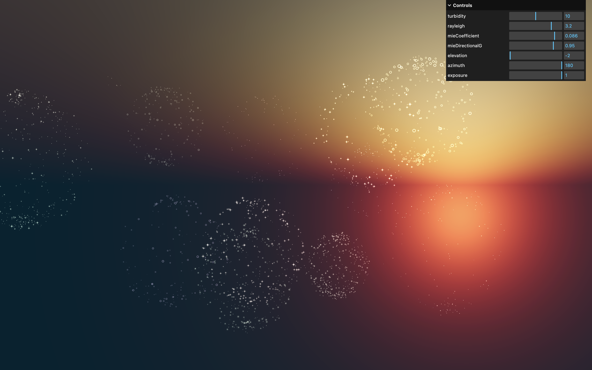

# 🌐 Three.js – Hologram Shader 🛸

Une scène 3D réalisée avec [Three.js](https://threejs.org/) qui permet de créer des feux d'artifices réalistes dans une scène avec un ciel paramétrable. Inspiré du parcours Three.js Journey par Bruno Simon.



## 🚀 Démo

[Voir la démo](https://rekuiem84.github.io/fireworks-shaders/)

## ✨ Fonctionnalités

- Feux d'artifice générés en points et animés avec `GSAP`
- Explosion, chute et scintillement gérés par shader
- Apparition aléatoire ou au clic de la souris
- Ciel paramétrable avec le Sky de Three.js
- Contrôles debug pour ajuster la taille, la densité, la durée et la forme des explosions

## 🛠️ Installation & Lancement

1. **Installer les dépendances :**

   ```bash
   npm install
   ```

2. **Lancer le serveur de développement :**

   ```bash
   npm run dev
   ```

3. **Générer un build de production :**

   ```bash
   npm run build
   ```

   Les fichiers optimisés sont générés dans le dossier `dist/`.

## 📁 Structure du projet

```
├── src/
│   └── shaders/
│       ├── firework/
│       │   ├── fragment.glsl
│       │   └── vertex.glsl
│       └── includes/
│           └── remap.glsl
├── static/
```

## 🎛️ Paramètres ajustables (via le menu debug)

- `size` : taille de base des particules du feu d'artifice
- `particlesCountMultiplier` : multiplie le nombre de particules générées
- `duration` : durée de l'animation
- `sphereRadius` : rayon de dispersion initial des particules
- `turbidity` : opacité / brume de l'atmosphère
- `rayleigh` : intensité de la diffusion du ciel
- `mieCoefficient` : intensité de la diffusion de Mie
- `mieDirectionalG` : directionnalité de la lumière dans le ciel
- `elevation` : hauteur du soleil dans le ciel
- `azimuth` : rotation horizontale du soleil
- `exposure` : exposition globale du rendu

## 🧪 Shaders

#### Vertex shader

- `uSize` : taille de base des points
- `uResolution` : résolution du canvas pour le calcul du point size
- `uProgress` : progression de l'animation de l'explosion
- `aSize` : taille individuelle de chaque particule
- `aTimeMultiplier` : variation de vitesse entre les particules

#### Fragment shader

- `uTexture` : texture de particule
- `uColor` : couleur du feu d'artifice

## 🔗 Mes autres projets Three.js

- [Repo Three.js Journey principal](https://github.com/Rekuiem84/threejs-journey) — pour retrouver tous mes projets suivant ce parcours
